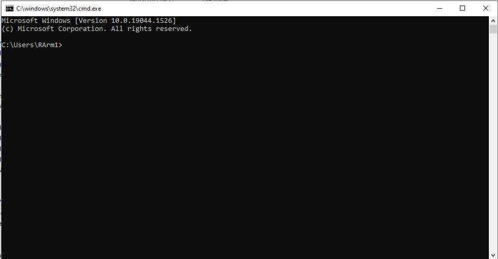
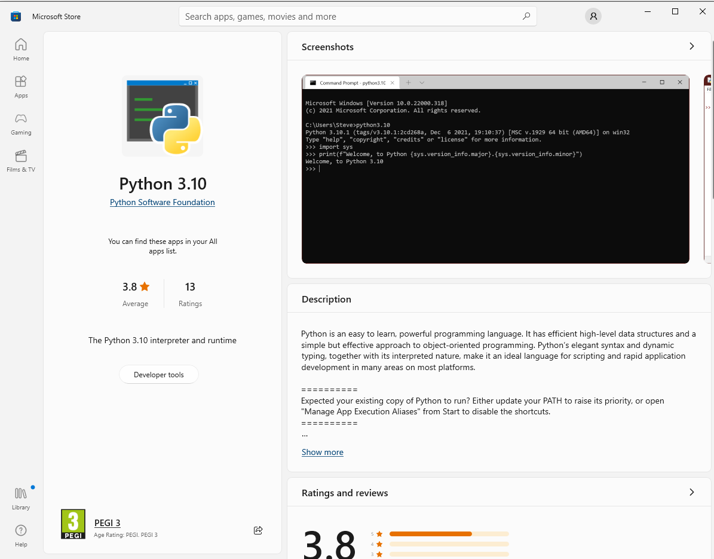
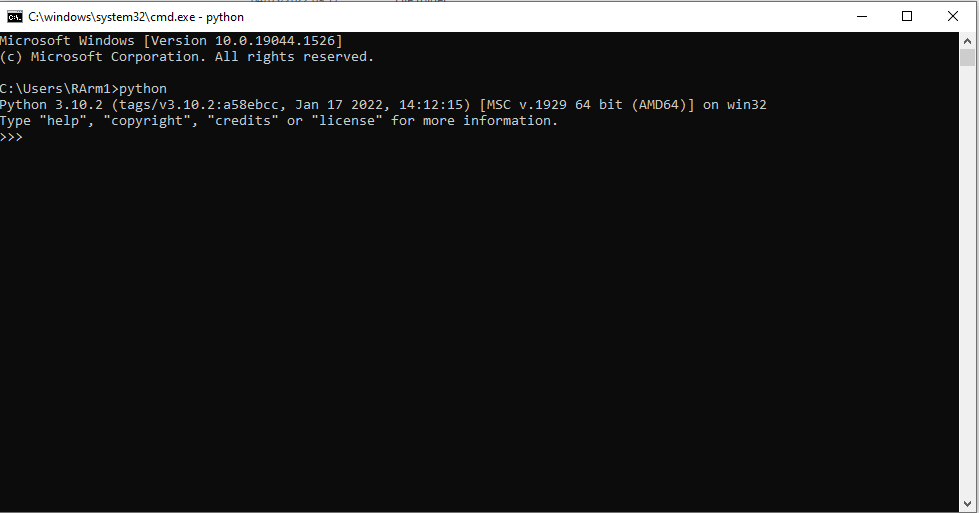

# TODO: Get to the correct directory should say trade writer #
# Try running this program from somewhere centralised #
# Instructions #
In order to run the rebalancer - or the trade reader outside an IDE, several steps must be taken to ensure python
can work in console. 

## Opening Command Prompt ##
First open 'Command Prompt'. This can either be done by searching in the Windows menu bar, or 
by pressing ctrl+r and entering 'cmd' in the Run window. Once this window is open:



## Install Python ##
To do this type 'python' in the window. If Python is not installed then it will open 'Microsoft Store' and direct the window
to the Python download screen. If you are not confident with this, or have never used Python before, 
this can be done under the supervision of the IT department. However, as long as these instructions 
are not deviated from, this is a matter of preference, over necessity.



Once this is installed. Enter 'python' in the console. That will open the Python Virtual Environment.



Python can then be exitted with 'ctrl+z' then enter. 


### Install Required Packages ###
This program has multiple dependancies to run effectively. These are libraries that this program draws from to enable
additional functionality 
Sys, Pandas, Datetime and OpenPyxl. To install these dependancies, 
the following code can be run in the Command Prompt.
```commandline
pip install --upgrade pip
pip install sys
pip install os
pip install pandas
pip install datetime
pip install openpyxl
```

## Get to the correct directory ##
Wherever the rebalancer project is installed, copy the Path from Windows Explorer. Enter 'cd path/to/balancer' where 
path/to/balancer is the copied directory. This runs the 'Change Directory' command and takes the focus to the rebalancer. 
This can be checked by entering the 'dir' command this runs the Directory command which will list all files.


## Running the program ##
To start the program, enter:
```commandline
python main.py
```
This will then present 2 options. Rebalancing or trade reading.

### Trade Reading ###
Trade reading will take completed rebalancer documents and generate a document for automated trading. 

The files used by the trade reading function are: 
- trade_reader.py
- trade_writer.py
- file_id_reader.py
- constants.py

Then within the 'constants' folder in the rebalancer project:
- scheme_list_desig.xlsx
- trade_identifier.xlsx

These files can be looking for using the following code, it will alert MISSING if there is a required file not present.
```commandline
IF NOT EXIST trade_reader.py ECHO trade_reader.py MISSING
IF NOT EXIST trade_writer.py ECHO trade_writer.py MISSING
IF NOT EXIST file_id_reader.py ECHO trade_reader.py MISSING
IF NOT EXIST constants.py ECHO constants.py.py MISSING
IF NOT EXIST Constants/scheme_list_desig.xlsx ECHO Constants/scheme_list_desig.xlsx MISSING
IF NOT EXIST Constants/trade_identifier.xlsx ECHO Constants/trade_identifier.xlsx MISSING
```


For this to work correctly there needs to be completed rebalancers in the root directory, and no other .xlsx files.
Blank rebalancers, or other .xlsx files will return a skewed output. 

### Tidy Trades Sheet ###
When the trades have been read, there are two columns that must be deleted from the completed sheet. 
The values cannot be deleted - both columns must be selected, then right clicked and then deleted. 
Otherwise when they are passed into Horizon, they will get incorrect input. 
